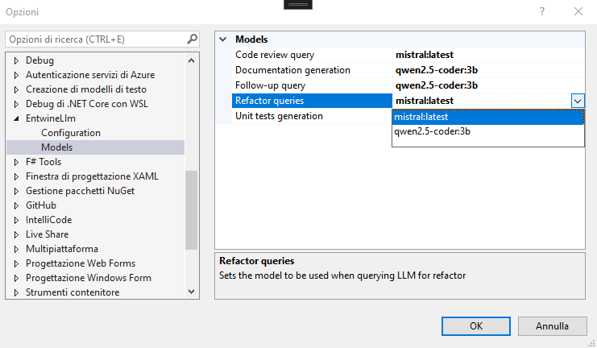

	

EntwineLLM is a free Visual Studio extension designed to leverage LLM capabilities to assist developers in writing code, without relying on third-party APIs. Instead, it uses an open LLM implementation installed locally on the user's PC, such as Ollama

#### Prerequisites

To use the EntwineLLM extension, you need to have a local or Docker-hosted open LLM implementation, such as Ollama. The LLM must be running and expose an accessible API endpoint that the extension can connect to. Ensure that the API is properly configured and reachable from within Visual Studio to enable seamless integration with the extension.

*Resources*:
* [Ollama download for Windows](https://ollama.com/download/windows)
* [Ollama models](https://ollama.com/search)

#### Setup
After installing the EntwineLLM extension, its configuration options will be available in the Visual Studio Options menu. These options allow users to specify the base URL of the locally installed LLM, select the LLM model to use for each specific extension command (install them first), and configure the HTTP request timeout settings for communication with the LLM. These settings provide flexibility in customizing the behavior of the extension to match the user's environment and preferences.

#### Using the extension
After installing the extension, the following commands will be available in the `EntwineLLM` menu, placed in `Extensions` menu:

* `Refactor code`: Select a block of code or text related to the function you wish to create, and the extension will call the LLM APIs available at the URL configured in the options. The extension will then present a window displaying the suggested code. If the user chooses to apply the suggestion, the new code will overwrite the originally selected text or code, seamlessly integrating the AI's assistance into the developer's workflow.
* `Generate unit tests`: Select a block of code or function, and this command will generate unit tests covering all paths for the selection. The extension queries the LLM and displays the results in a separate window. If accepted, the generated tests can be applied directly to the codebase.
* `Follow-up`: After generating code using EntwineLLM, users can utilize the Follow-up field to submit additional prompts that build upon the original code generation request. This feature allows for iterative refinement of the generated code, enabling users to clarify requirements, request modifications, or explore alternative implementations seamlessly within the same workflow. The follow-up prompt is sent to the LLM, which produces updated results tailored to the additional input provided. This functionality enhances the extension's flexibility and precision, ensuring that developers can achieve exactly the results they need.
* `Document code`: Generate a markdown file with exhaustive documentation about selected code. The file can be saved as Markdown or exported as HTML.
* `Code review`: The LLM will act as an experienced developer, and will spot issues, performance problems, and give a full review on selected code, with hints and comments about the strategies that can be applied to fix it.

All the available functions can overwrite the originally selected code with the generate one by pressing the `Apply` button, or save it in a dinamically named file, which will be persisted on disk and under the current project folder, by pressing `Save` button. This allows users to inspect and integrate the new code into their workflow at their discretion.

#### How it works
The prompts for this extension are designed to work with multiple programming languages, such as C#, Python, Java. Prompts have a strict set of rules: requests unrelated to coding are rejected. If the request involves refactoring code, it follows Clean Code principles, ensuring readability, maintainability, and performance, with no extra explanations or comments provided. For new code requests, the same principles apply, with the emphasis on modularity, testability, and high performance. All code is provided in raw format, following strict style guidelines (Allman-style braces, vertical slicing) with no comments or additional context.

#### Why Entwine?
The name Entwine and its logo, resembling the helix of DNA, symbolize the union of two forces: the natural intelligence and skills of the developer, and the artificial intelligence provided by the LLM. Just as DNA represents the intricate intertwining of biological elements that form life, Entwine reflects the harmonious connection between human creativity and AI-driven assistance. This synergy allows developers to harness the power of LLMs, enhancing their coding process while retaining their unique problem-solving abilities, creating a seamless collaboration between human and machine.